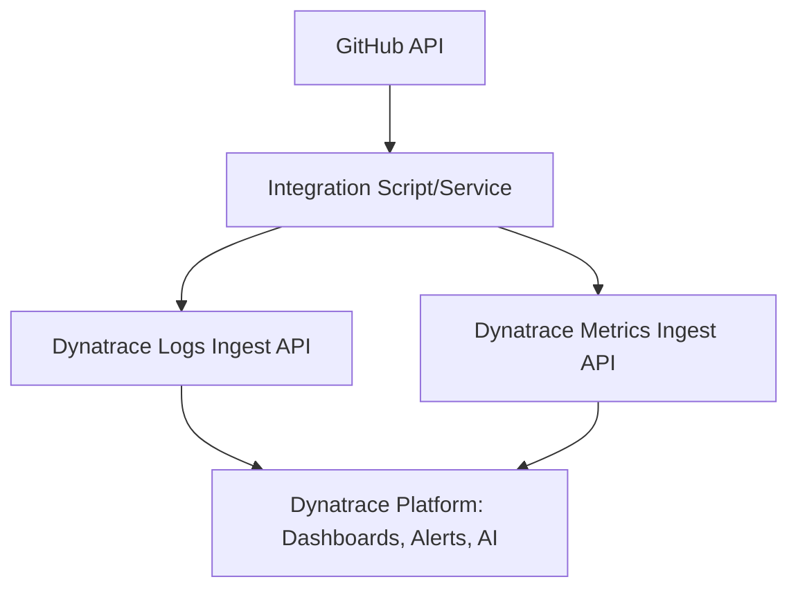

Absolutely! Let’s make it super clear for both business and technical folks. I’ll give you a detailed markdown doc—explain the business value, then go step-by-step for developers (with some architecture, key API calls, and even a sample payload), plus how to set up dashboards/alerts in Dynatrace. This way, anyone from a CTO to a hands-on dev can get the full picture and even start building the integration.

---

# Integrating GitHub Data with Dynatrace

*How to Connect GitHub API Metrics to Dynatrace for Full Engineering Observability*

---

## 🚀 Why Integrate GitHub with Dynatrace?

For business leaders and tech managers, knowing what’s happening in engineering is critical—delivery speed, code quality, and process health are all tied to business outcomes.

**By streaming GitHub metrics/events into Dynatrace, you:**

* Get real-time, always-on visibility into engineering workflows
* Can spot issues, delays, and risks early—before they impact customers
* Track both technical and human factors (like review bottlenecks, deployment velocity, or contributor activity)
* Have one place for infrastructure, application, AND DevOps metrics—driving real DevSecOps culture

*Source: “Key Metrics for Dev Teams from GitHub API Endpoints”*.

---

## 🛠️ What Data Can Be Pushed from GitHub?

With the GitHub API, you can extract:

* Commits (when, by whom, frequency)
* Pull Requests (open/closed, time to review, merged, blocked)
* Issues (bugs/features, open/closed, mean time to resolution)
* Workflow Runs (CI/CD pipeline success/failure, deployment stats)
* Security Alerts (code scanning, dependabot, vulnerabilities)
* Contributor Metrics (active users, new contributors, “bus factor” risk)
* Repository-level and Org-wide trends

All these data points become **metrics** and **logs** you can visualize, alert on, and trend in Dynatrace.

---

## 🏗️ Architecture Overview



* **Integration Service:** Polls GitHub API, processes data
* **Logs Ingest API:** For event streams (like PR/Issue open/close, workflow runs, security events)
* **Metrics Ingest API:** For numerical KPIs (review time, PR throughput, deployment rate, etc.)
* **Dynatrace:** All your metrics & logs—one view, rich analytics, AI, and alerts

---

## 👨‍💻 Developer Step-by-Step Guide

### 1. Register a GitHub App / Create a Personal Access Token

* [Create a GitHub PAT](https://github.com/settings/tokens) (needs `repo`, `read:org`, `read:security_events`, `read:user` scopes as needed)
* Or, use a GitHub App for tighter control

### 2. Choose Key Metrics to Track

Reference from the doc:

* PRs merged per week/month
* Average PR review/merge time
* Issue open/close counts
* Workflow run success/failures
* Security alert counts
* Contributor activity

### 3. Query GitHub API

**Example: Get All PRs for a Repo**

```http
GET /repos/{owner}/{repo}/pulls?state=all
Authorization: Bearer <TOKEN>
```

[GitHub API Docs](https://docs.github.com/en/rest)

**Example: Get Workflow Runs**

```http
GET /repos/{owner}/{repo}/actions/runs
```

### 4. Structure the Data

* For logs: Make a JSON payload per event, include relevant dimensions (repo, user, status, timestamps)
* For metrics: Compute numbers like `avg_review_time_seconds`, `open_pr_count`, `closed_issue_count`, `deployment_success_rate`, etc.

**Sample Metric Payload for Dynatrace Metrics API**

```json
[
  {
    "metric": "github.pr.review_time",
    "dataPoints": [[ 1627852800000, 3600 ]],
    "dimensions": { "repo": "my-repo", "org": "my-org" }
  }
]
```

* **metric:** Metric name (namespace it sensibly)
* **dataPoints:** `[ [timestamp, value] ]` format, epoch in ms
* **dimensions:** Any labels for easy filtering (org, repo, team, user)

**Sample Log Payload for Dynatrace Logs API**

```json
{
  "timestamp": "2024-08-04T12:34:56Z",
  "content": {
    "eventType": "pull_request_merged",
    "repo": "my-repo",
    "pr_number": 42,
    "merged_by": "alice",
    "merge_time_seconds": 1234
  }
}
```

### 5. Send Data to Dynatrace

* **Logs API**:
  [Dynatrace Docs](https://www.dynatrace.com/support/help/dynatrace-api/environment-api/logs/ingest-logs)

  * POST JSON to `https://<ENVIRONMENT_ID>.live.dynatrace.com/api/v2/logs/ingest`
  * Use your Dynatrace API token (`Ingest logs` permission)

* **Metrics API**:
  [Dynatrace Docs](https://www.dynatrace.com/support/help/dynatrace-api/environment-api/metrics/post-ingest-metrics)

  * POST JSON to `https://<ENVIRONMENT_ID>.live.dynatrace.com/api/v2/metrics/ingest`
  * Use API token (`Ingest metrics` permission)

**Sample cURL for Metrics:**

```bash
curl -X POST "https://<ENV>.live.dynatrace.com/api/v2/metrics/ingest" \
  -H "Authorization: Api-Token <DT_API_TOKEN>" \
  -H "Content-Type: application/json" \
  -d '[{ "metric":"github.pr.review_time", "dataPoints":[[1627852800000,3600]], "dimensions": {"repo":"my-repo"} }]'
```

**Sample cURL for Logs:**

```bash
curl -X POST "https://<ENV>.live.dynatrace.com/api/v2/logs/ingest" \
  -H "Authorization: Api-Token <DT_API_TOKEN>" \
  -H "Content-Type: application/json" \
  -d '{"timestamp":"2024-08-04T12:34:56Z","content":{"eventType":"pull_request_merged","repo":"my-repo"}}'
```

### 6. Automate: Schedule Periodic Data Sync

* Use a simple Node.js/Python script, GitHub Actions, or a cloud function to poll GitHub and push to Dynatrace every X minutes/hours OR see below.

## 🤖 Automating GitHub → Dynatrace Ingestion with Dynatrace Automation Workflows

### Why Use Dynatrace Workflows?

Instead of running your own scripts on servers, you can let Dynatrace handle scheduling, execution, error handling, and even downstream actions—all within its Automation Workflows platform.
This makes your GitHub-to-Dynatrace integration cloud-native, reliable, and low-maintenance.

**What’s the benefit?**

* Zero infrastructure: No VMs, no containers, no external schedulers
* Secure: API tokens and secrets are managed in Dynatrace
* Flexible: Use built-in or custom actions (HTTP calls, scripts, notifications, etc.)
* Observable: All runs, failures, and outputs are logged and can trigger further actions

---

### Example: Pull GitHub Metrics and Ingest to Dynatrace Using a Workflow

**Here’s how a typical workflow looks:**

1. **Trigger:**

   * Scheduled (every 1 hour, for example)
   * Or on demand

2. **Steps:**

   * Use Dynatrace’s HTTP action to call GitHub API (with your token/secret)
   * Transform/process the data (optional—use JavaScript code block)
   * Send the results to Dynatrace Metrics API and/or Logs API (another HTTP action)
   * Optionally, notify teams if something goes wrong or thresholds are crossed

**Example (simplified YAML style):**

```yaml
workflow:
  trigger:
    type: schedule
    cron: "0 * * * *"  # every hour
  actions:
    - name: Fetch GitHub PRs
      type: http
      config:
        url: "https://api.github.com/repos/<org>/<repo>/pulls?state=all"
        method: GET
        headers:
          Authorization: "Bearer ${GITHUB_TOKEN}"
    - name: Transform Data
      type: code
      language: javascript
      script: |
        // parse response, calculate metrics
        const prCount = response.length;
        const avgReviewTime = // ... calculate average
        return { prCount, avgReviewTime };
    - name: Send Metrics to Dynatrace
      type: http
      config:
        url: "https://<DT_ENV>.live.dynatrace.com/api/v2/metrics/ingest"
        method: POST
        headers:
          Authorization: "Api-Token ${DT_API_TOKEN}"
        body: |
          [{
            "metric": "github.pr.count",
            "dataPoints": [[Date.now(), ${prCount}]],
            "dimensions": {"repo": "<repo>", "org": "<org>"}
          },
          {
            "metric": "github.pr.avg_review_time",
            "dataPoints": [[Date.now(), ${avgReviewTime}]],
            "dimensions": {"repo": "<repo>", "org": "<org>"}
          }]
```

**You can build this visually** in Dynatrace AutomationEngine (Workflows UI), so even non-coders can drag, drop, and configure these actions.

---

### Example Automation Scenarios

* **Scheduled polling:** Run every hour/day to fetch latest GitHub org stats, push to Dynatrace.
* **Error-triggered actions:** If a metric or log ingested crosses a threshold, run a workflow to auto-notify the engineering lead on Slack, Teams, or email.
* **Chained remediation:** Spot a spike in open security alerts? Trigger a follow-up workflow to open a JIRA ticket or ServiceNow incident automatically.
* **Self-healing CI/CD:** Detect repeated build failures in logs—auto-notify, roll back, or trigger deeper diagnostics.

---

### How to Set Up

1. Go to **AutomationEngine > Workflows** in Dynatrace.
2. Create a new workflow and pick a trigger (scheduled or on-demand).
3. Add HTTP actions for GitHub API and Dynatrace API calls.
4. Add any code logic needed (JavaScript is natively supported).
5. Use secure credential storage for your tokens.
6. Add notifications, branching logic, or downstream integrations as needed.
7. Save, test, and monitor—all from the Dynatrace UI.

---

## 💡 Pro-Tip

Workflows are reusable! You can parameterize repo/org names, so the same automation works for multiple teams or projects.

---

**All this further amplifies the value of GitHub data in Dynatrace:**
You’re not just visualizing data—you’re *acting on it*, automatically, as soon as something important happens.

---

*[This section builds on the recommended architecture and metrics in “Key Metrics for Dev Teams from GitHub API Endpoints” and leverages the latest Dynatrace AutomationEngine features.](../assets/github.pdf)*

---

## 📊 Setting Up Dashboards & Alerts in Dynatrace

* **Dashboards:**
  Use your ingested metrics and logs to build engineering health dashboards:

  * PR review/merge time over time
  * Deployment frequency trend
  * Open issues/PRs by repo/team
  * Security alerts by status
  * Contributor activity

* **Alerts:**
  Set up anomaly or static threshold alerts for:

  * Sudden drop in deployment frequency
  * Spike in open issues/PRs
  * High security alert counts

* **AI Assistance:**
  Leverage Dynatrace Davis AI to auto-detect outliers, bottlenecks, or drops in engineering performance.

---

## 🔗 Example Use Cases

* Spot when PR reviews are piling up, and notify the right team
* Alert when a deployment fails in CI/CD more than X times in a day
* Visualize contributor activity—find bus factor risk early
* Track security alert closure time for compliance

---

## 📑 References

* **Key Metrics for Dev Teams from GitHub API Endpoints**
  (Full list of recommended metrics and GitHub API endpoints you can use as a starting point)

* [Dynatrace API: Logs Ingest](https://www.dynatrace.com/support/help/dynatrace-api/environment-api/logs/ingest-logs)

* [Dynatrace API: Metrics Ingest](https://www.dynatrace.com/support/help/dynatrace-api/environment-api/metrics/post-ingest-metrics)

* [GitHub REST API Docs](https://docs.github.com/en/rest)

* [GitHub GraphQL API Docs](https://docs.github.com/en/graphql)

---

## 🙌 Conclusion

This integration gives your org a single, actionable view of engineering health, right next to your app and infra monitoring—no more guesswork, just insight.
You can start with just a few key metrics and grow over time.
If you want ready-to-use code snippets or dashboard templates, just ask!

---

*Based on “Key Metrics for Dev Teams from GitHub API Endpoints”, your go-to source for GitHub org health tracking*.
