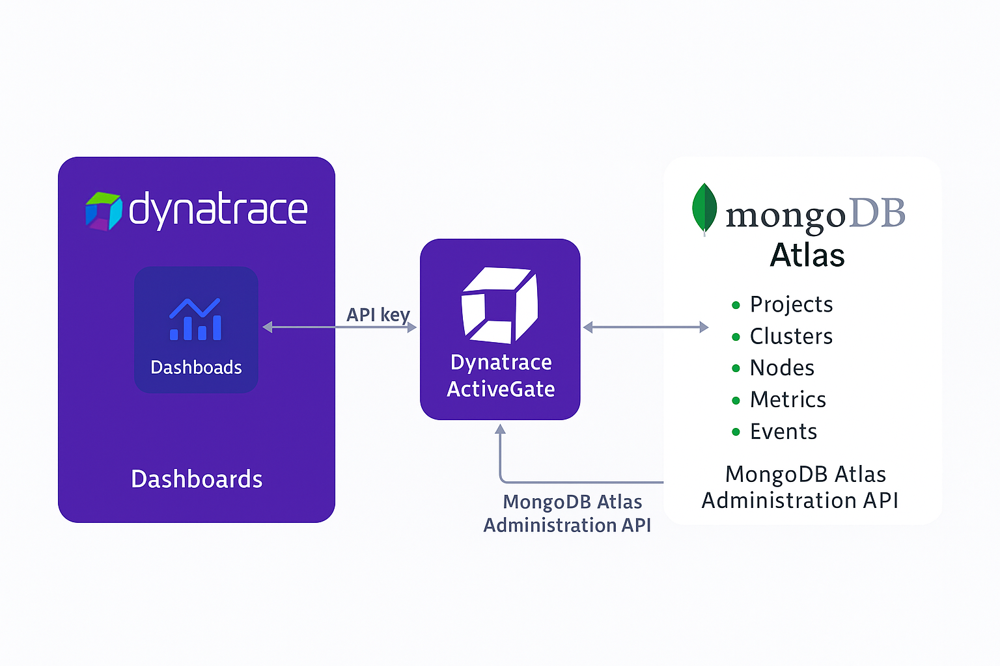

# MongoDB Atlas Monitoring with Dynatrace

## Overview

This document provides a comprehensive guide on integrating MongoDB Atlas with Dynatrace using the official Dynatrace MongoDB Atlas extension. This integration enables real-time monitoring, observability, and automated anomaly detection powered by Dynatrace's Davis AI.

**For detailed extension content, visit:** [Dynatrace MongoDB Atlas Extension](https://www.dynatrace.com/hub/detail/mongodb-atlas/)

---

## Table of Contents

1. [Introduction](#introduction)
2. [Pre-requisites](#pre-requisites)
3. [Architecture and Data Flow](#architecture-and-data-flow)
4. [API Endpoints and Data Collection](#api-endpoints-and-data-collection)
5. [API Key Creation & Security](#api-key-creation--security)
6. [Configuring Dynatrace Extension](#configuring-dynatrace-extension)
7. [Dynatrace Metrics & Events](#dynatrace-metrics--events)
8. [Troubleshooting & Best Practices](#troubleshooting--best-practices)
9. [Security and Compliance Considerations](#security-and-compliance-considerations)
10. [FAQ](#faq)
11. [Supporting Links](#supporting-links)

---

## Introduction

The MongoDB Atlas Dynatrace extension enables seamless observability of MongoDB Atlas deployments within Dynatrace environments, providing visibility into performance metrics, operational insights, and anomaly detection capabilities. Dynatrace's AI-driven insights and dashboards enhance operational efficiency and proactive issue resolution.

---

## Pre-requisites

Ensure the following before starting the integration:

* Active Dynatrace environment (SaaS/Managed)
* Access to MongoDB Atlas environment with necessary administrative permissions
* MongoDB Atlas Admin API key (read-only preferred)
* Dynatrace ActiveGate with outbound internet connectivity
* MongoDB Atlas Project ID

---

## Architecture and Data Flow

Diagram showing the integration architecture between Dynatrace and MongoDB Atlas. On the left, a purple box labeled Dynatrace contains an icon for Dashboards and the word Dashboards. In the center, a purple box labeled Dynatrace ActiveGate connects Dynatrace to MongoDB Atlas. Arrows indicate data flow: an API key connects Dashboards to Dynatrace ActiveGate, and Dynatrace ActiveGate communicates with MongoDB Atlas using the MongoDB Atlas Administration API. On the right, a white box labeled MongoDB Atlas lists Projects, Clusters, Nodes, Metrics, and Events, with each item marked by a green dot. The diagram visually explains how Dynatrace ActiveGate securely collects monitoring data from MongoDB Atlas and makes it available for analysis and visualization in Dynatrace dashboards. The tone is neutral and informative, focusing on technical clarity.

### Architectural Overview

* **Dynatrace ActiveGate**: The central component facilitating secure API communication.
* **MongoDB Atlas API**: Dynatrace fetches monitoring data via secure API calls.
* **Data Flow**: ActiveGate securely pulls data from MongoDB Atlas API and pushes it into Dynatrace for analysis.

### Step-by-Step Data Flow

1. Dynatrace securely stores Atlas Admin API keys.
2. ActiveGate initiates secure API calls (HTTPS GET) to MongoDB Atlas.
3. Atlas responds with JSON-formatted metrics and event data.
4. Dynatrace converts and ingests data, visualizing it on dashboards and processing it for Davis AI.

---

## API Endpoints and Data Collection

Dynatrace extension fetches data from the following MongoDB Atlas Admin API endpoints:

| Purpose                    | API Endpoint                                                       |
| -------------------------- | ------------------------------------------------------------------ |
| List Projects              | `GET /groups`                                                      |
| Get Clusters               | `GET /groups/{projectId}/clusters`                                 |
| Get Processes              | `GET /groups/{projectId}/processes`                                |
| Process Metrics            | `GET /groups/{projectId}/processes/{hostname}:{port}/measurements` |
| Disk Partitions (optional) | `GET /groups/{projectId}/processes/{hostname}:{port}/disks`        |
| Project Events (optional)  | `GET /groups/{projectId}/events`                                   |

These endpoints are read-only, ensuring no modification to MongoDB data or configuration.

---

## API Key Creation & Security

### Recommended API Key Permissions

* `ORG_READ_ONLY` for org-wide metrics [For more details about Org API](https://www.mongodb.com/docs/atlas/configure-api-access/#std-label-create-org-api-key).
* `PROJECT_READ_ONLY` for single-project monitoring
* `PROJECT_DATA_ACCESS_ADMIN` for detailed metrics collection (recommended)

### Security Best Practices

* Securely store API keys in Dynatrace configuration.
* Regularly rotate API keys based on company policies.
* Restrict IP whitelist in Atlas to ActiveGate IP addresses.

---

## Configuring Dynatrace Extension

Follow these steps in Dynatrace:

1. Navigate to Dynatrace Hub → MongoDB Atlas Extension.
2. Install the extension on an ActiveGate.
3. Configure the following:

   * Project ID
   * Atlas API Public and Private keys
   * Polling interval (default: 1 min recommended)
   * Optionally enable disk partition and event monitoring.
4. Save configuration and verify the connection status.

---

## Dynatrace Metrics & Events

### Collected Metrics

* CPU, memory, network, connections, and storage usage
* Disk performance metrics (if enabled)

### Collected Events (if enabled)

* Authentication events
* Cluster changes (creation, deletion)
* Backup and restore operations
* Operational alerts from MongoDB Atlas

All events appear as log events in Dynatrace, allowing custom log analytics.

---

## Troubleshooting & Best Practices

### Common Issues

* **API access errors**: Validate API key roles and IP whitelisting.
* **Missing metrics/events**: Ensure correct API permissions.

### Best Practices

* Use dedicated monitoring-only API keys.
* Regularly validate data ingestion and dashboards.
* Monitor ActiveGate health and connectivity.

---

## Security and Compliance Considerations

* Data transferred is read-only.
* API keys stored securely in Dynatrace.
* Ensure compliance with organizational security policies (GDPR, ISO 27001).

---

## FAQ

**Q: Can Dynatrace modify MongoDB Atlas data?**

A: No, all API calls are read-only.

**Q: Can I scope API keys?**

A: Yes, use `PROJECT_READ_ONLY` for specific project-level scoping.

**Q: How often is data fetched?**

A: Default polling interval is every minute, adjustable based on requirements.

---

## Supporting Links

* [Dynatrace MongoDB Atlas Extension Documentation](https://www.dynatrace.com/hub/detail/mongodb-atlas/)
* [MongoDB Atlas API Documentation](https://www.mongodb.com/docs/atlas/api/)
* [Dynatrace ActiveGate Documentation](https://www.dynatrace.com/support/help/setup-and-configuration/dynatrace-activegate/)
* [Dynatrace Security Overview](https://www.dynatrace.com/security/)

---

This document ensures secure and efficient integration of MongoDB Atlas with Dynatrace, leveraging industry best practices for monitoring and observability.
