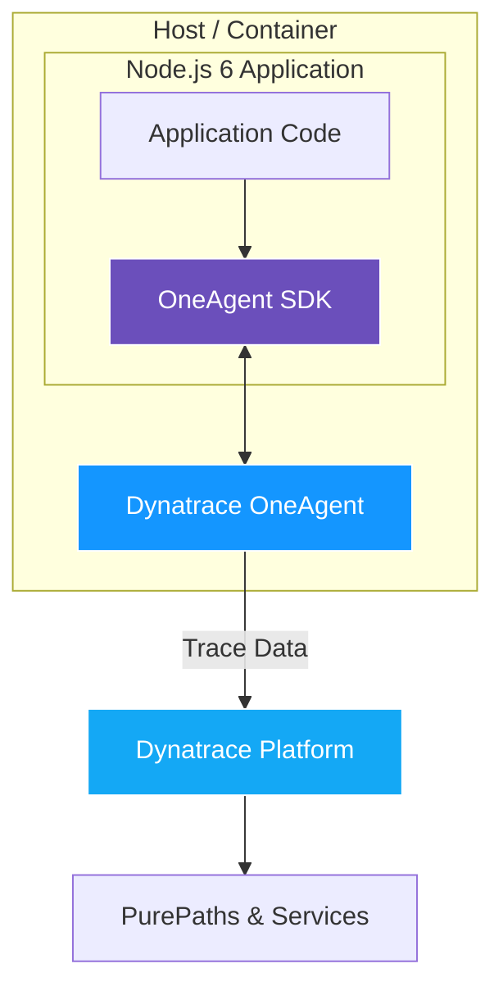
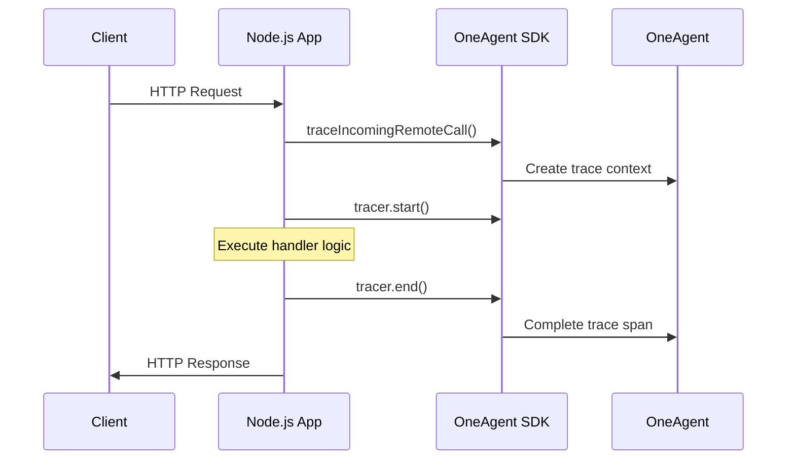
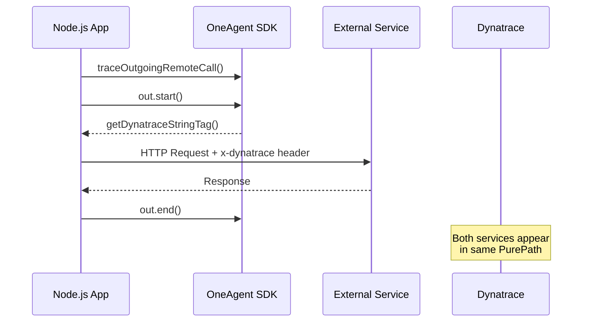
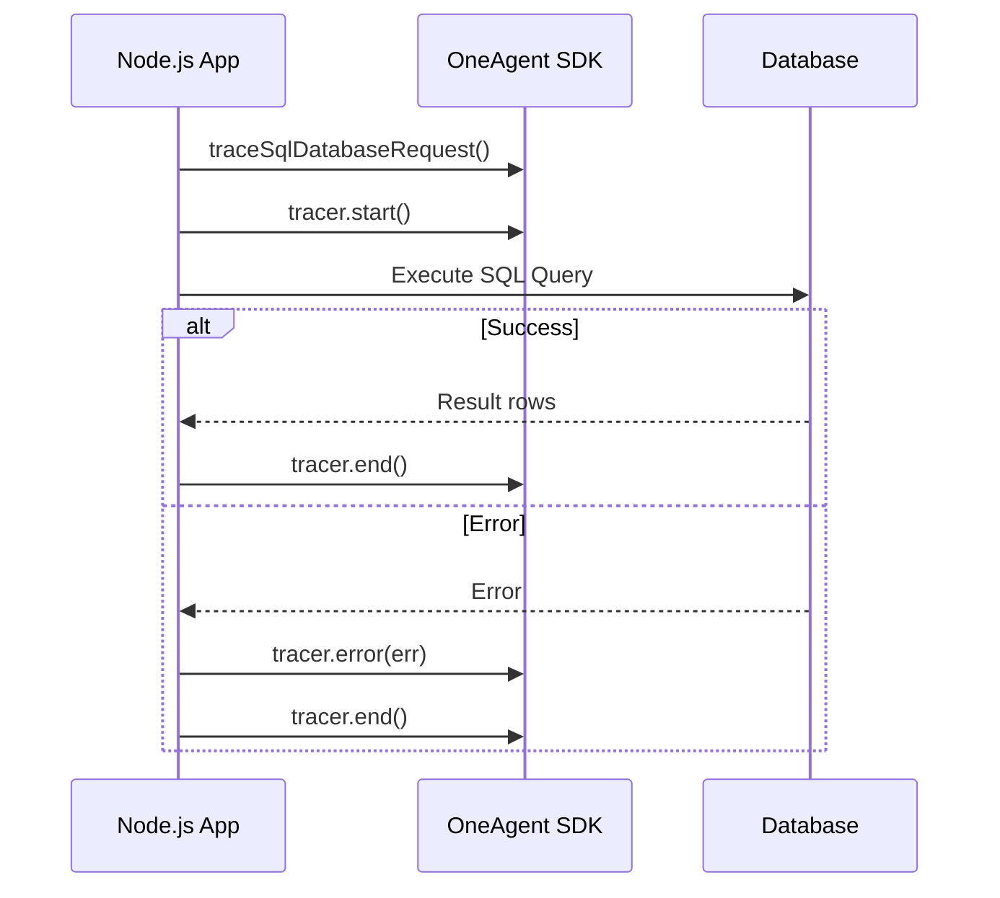
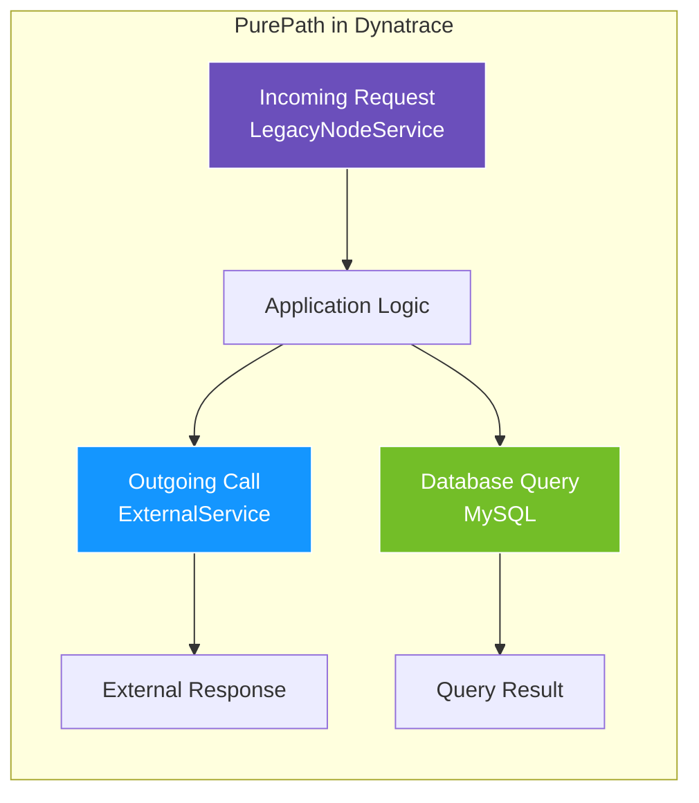

# **Dynatrace OneAgent SDK for Node.js**

Step-by-Step Integration Guide (For Legacy Node.js 6 Applications)**

Modern OneAgent auto-instrumentation does not support Node.js 6.
To enable observability for legacy applications, the Dynatrace OneAgent SDK for Node.js provides a fully manual instrumentation approach. This guide explains how to instrument a Node.js 6 application using the SDK, ensuring incoming requests, outgoing calls, and database operations are visible in Dynatrace.

---

## Table of Contents

1. [Prerequisites](#1-prerequisites)
2. [Install the SDK](#2-install-the-sdk)
3. [Load the SDK in the Application Entry Point](#3-load-the-sdk-in-the-application-entry-point)
4. [Verify the SDK Is Active](#4-verify-the-sdk-is-active)
5. [Instrument Incoming HTTP Requests](#5-instrument-incoming-http-requests)
6. [Instrument Outgoing HTTP Calls](#6-instrument-outgoing-http-calls)
7. [Instrument Database Calls](#7-instrument-database-calls)
8. [Preserve Context in Asynchronous Code](#8-preserve-context-in-asynchronous-code)
9. [Adding Custom Attributes (Optional)](#9-adding-custom-attributes-optional)
10. [Validation in Dynatrace](#10-validation-in-dynatrace)
11. [Troubleshooting](#11-troubleshooting)
12. [Rollout Recommendations](#12-rollout-recommendations)
13. [Clean Rollback Plan](#13-clean-rollback-plan)

---

## Architecture Overview

The following diagram shows how the OneAgent SDK integrates with your Node.js application and sends trace data to Dynatrace:



---

# **1. Prerequisites**

Before starting, ensure:

1. **Dynatrace OneAgent is installed and running** on the same host/container where the Node.js 6 application runs. The SDK depends on the presence of OneAgent.
2. You have access to modify the Node.js application source code.
3. You can install additional NPM packages.
4. The application restart is possible after SDK integration.

---

# **2. Install the SDK**

Run this inside the application folder:

```bash
npm install --save @dynatrace/oneagent-sdk
```

---

# **3. Load the SDK in the Application Entry Point**

Add this at the top of `index.js` (or your main server file):

```js
const Sdk = require('@dynatrace/oneagent-sdk');
const dta = Sdk.createInstance();

// Optional but recommended: capture SDK logs for troubleshooting
dta.setLoggingCallback((level, message) => {
  console.log('[OneAgent SDK]', level, message);
});
```

This creates the SDK instance used to generate traces.

---

# **4. Verify the SDK Is Active**

Start the app.
Check the logs for SDK messages confirming that it is connected to OneAgent.

If the SDK is not active:

* Ensure OneAgent is running on the host.
* Ensure SDK is loaded **after** OneAgent is loaded.

---

# **5. Instrument Incoming HTTP Requests**

This is the entry point for tracing.
Every route or HTTP handler should create an *incoming remote call* tracer.



### **Example: Plain HTTP Server**

```js
const http = require('http');

const server = http.createServer((req, res) => {
  const tracer = dta.traceIncomingRemoteCall(
    'LegacyNodeService',
    'HTTP',
    `${req.method} ${req.url}`
  );

  return tracer.start(() => {
    // Your handler logic
    res.writeHead(200, { 'Content-Type': 'text/plain' });
    res.end('OK');

    tracer.end();
  });
});

server.listen(3000);
```

### **Example: Express Route**

```js
app.get('/customer', (req, res) => {
  const tracer = dta.traceIncomingRemoteCall(
    'LegacyNodeService',
    'HTTP',
    `${req.method} ${req.path}`
  );

  return tracer.start(() => {
    // Route logic
    res.json({ status: 'success' });

    tracer.end();
  });
});
```

---

# **6. Instrument Outgoing HTTP Calls**

Outgoing calls should carry the Dynatrace tag for distributed tracing.



```js
const out = dta.traceOutgoingRemoteCall(
  'ExternalService',
  'HTTP',
  'GET /api/v1/data'
);

out.start();

const tag = out.getDynatraceStringTag(); // attach to headers

const options = {
  hostname: 'external.service.local',
  path: '/api/v1/data',
  method: 'GET',
  headers: { 'x-dynatrace': tag }
};

const req = http.request(options, (resp) => {
  resp.on('data', () => {});
  resp.on('end', () => {
    out.end();
  });
});

req.on('error', (err) => {
  out.error(err);
  out.end();
});

req.end();
```

This ensures downstream services appear in the same PurePath.

---

# **7. Instrument Database Calls**

For SQL queries, wrap them in a database tracer.



```js
const tracer = dta.traceSqlDatabaseRequest(
  'mysql',
  'SELECT * FROM users WHERE id=?'
);

tracer.start();

db.query('SELECT * FROM users WHERE id=?', [userId], (err, rows) => {
  if (err) {
    tracer.error(err);
  }

  tracer.end();

  // Continue with normal handling
});
```

---

# **8. Preserve Context in Asynchronous Code**

Node.js 6 uses callbacks heavily.
If the async library breaks execution context, you may need to use `passContext()`.

```js
someAsyncFunction(
  param,
  dta.passContext(function callback(err, result) {
    // This will keep the tracing context active
  })
);
```

Use `passContext()` only when you see context gaps in traces.

---

# **9. Adding Custom Attributes (Optional)**

If you want additional metadata on traces (tenant ID, customer ID, etc.), you can attach them to tracers before `end()`.

Example:

```js
tracer.addCustomRequestAttribute('tenant.id', tenantId);
tracer.addCustomRequestAttribute('customer.segment', segment);
```

This helps with filtering and analysis in Dynatrace.

---

# **10. Validation in Dynatrace**

The following diagram shows a complete instrumented request flow as it appears in Dynatrace:



After deploying:

1. Trigger HTTP requests to the instrumented routes.
2. Open Dynatrace → Services.
3. Look for your service name (e.g., **LegacyNodeService**).
4. Open a PurePath and verify:

   * Incoming service call is detected.
   * Outgoing HTTP calls appear.
   * Database statements appear.
   * Custom attributes show up if you configured them.

---

# **11. Troubleshooting**

### **No traces appear**

* OneAgent is not running on the host.
* SDK was loaded before OneAgent.
* Application restarted without redeploying OneAgent.

### **Outgoing calls not connected**

* Ensure the Dynatrace tag header was included.
* Ensure the downstream system supports tag extraction.

### **Missing segments inside async functions**

* Wrap the callback using `dta.passContext()`.

### **SDK log shows warnings**

* Review the messages printed through your logging callback.
* Often related to incorrect tracer lifecycle (`start()` / `end()` order).

---

# **12. Rollout Recommendations**

1. Start with one or two routes in development.
2. Validate PurePaths in Dynatrace.
3. Gradually expand instrumentation to other routes and DB calls.
4. Apply to production only after successful validation.
5. Plan long-term migration away from Node.js 6 to allow native auto-instrumentation.

---

# **13. Clean Rollback Plan**

If anything causes issues:

1. Remove or comment out the SDK `require()` and tracer calls.
2. Restart the application.
3. Functionality will remain unchanged — only observability is removed.
